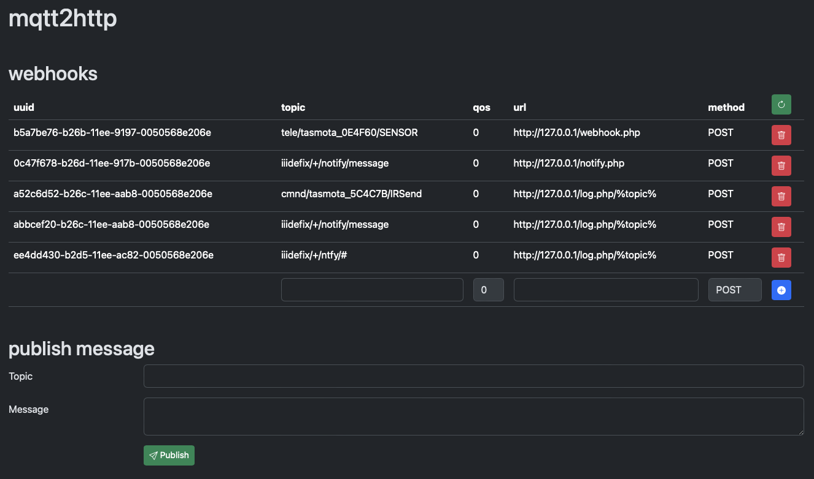

# mqtt2html

A simple MQTT to HTTP bridge.




## configuration

### environment variables

with default values:

- mqtt-client:
	- `MQTT_HOST`="127.0.0.1"
	- `MQTT_PORT`=1883
	- `MQTT_USER`=""
	- `MQTT_PASS`=""
- http-server:
	- `HTTP_BIND`="::"
	- `HTTP_PORT`=8080
- logging
	- `LOG_LEVEL`=WARNING


### startup config

json object with subscription webhooks to be loaded at startup

see GET / POST `list` endpoint for format

```bash
curl http://127.0.0.1:8080/list > startup.json
```
```bash
wget -O startup.json http://127.0.0.1:8080/list
```


## GET / POST

* URL parameter take precedence over POST data.
* Request data has to be a json object or empty


### Endpoint: `subscribe`

subscribe to a mqtt topic to receive a http request on published data

received mqtt data will be send as request body (POST data) without any encapsulation

if URL contains `%topic%` it will be replaced with the mqtt topic where data was received from. Handy for wildcard subscriptions

#### Parameter / request data object:

* `topic`: mqtt topic (required)
* `url`: webhook url (required)
* `qos`: mqtt qos (optional, default: `0`)
* `method`: http method (optional, default: `POST`)

#### Response:

json status object with subscription uuid

#### Example 1:

```bash
curl 'http://127.0.0.1:8080/subscribe?topic=cmnd/tasmota_24D0BE/Power1&url=http%3A%2F%2F127.0.0.1%2Fwebhook.php%3Ftopic%3D%25topic%25'
```
> ```json
> {"status":"ok","uuid":"fd940b12-b0dc-11ee-a34b-0050568e206e"}
> ```

#### Example 2:

```bash
curl \
	--request POST \
	--header "Content-Type: application/json" \
	--data '{"topic":"tele/+/RESULT","url":"http://127.0.0.1/webhook.php?topic=%topic%"}' \
	http://127.0.0.1:8080/subscribe
```
> ```json
> {"status":"ok","uuid":"1229f816-b0dd-11ee-a34b-0050568e206e"}
> ```


### Endpoint: `unsubscribe`

remove a subscription

#### Parameter / request data object:

* `uuid`: subscription uuid (required)

#### Response:

json status object

#### Example 1:

```bash
curl 'http://127.0.0.1:8080/unsubscribe?uuid=fd940b12-b0dc-11ee-a34b-0050568e206e'
```
> ```json
> {"status":"ok"}
> ```

#### Example 2:

```bash
curl \
	--request POST \
	--header "Content-Type: application/json" \
	--data '{"uuid":"a5505e72-b0d9-11ee-b9b3-0050568e206e"}' \
	http://127.0.0.1:8080/unsubscribe
```
> ```json
> {"status":"ok"}
> ```


### Endpoint: `list`

list subscription webhooks

#### Parameter / request data object:

* none

#### Response:

json list object:

* key: `subscription uuid`
* properties
	* `topic`
	* `qos`
	* `url`
	* `method`

#### Example:

```bash
curl http://127.0.0.1:8080/list | jq
```
> ```json
> {
> 	"fd940b12-b0dc-11ee-a34b-0050568e206e": {
> 		"topic": "cmnd/tasmota_24D0BE/Power1",
> 		"qos": 0,
> 		"url": "http://127.0.0.1/webhook.php?topic=%topic%",
> 		"method": "POST"
> 	},
> 	"1229f816-b0dd-11ee-a34b-0050568e206e": {
> 		"topic": "cmnd/tasmota_24D0BE/Power1",
> 		"qos": 0,
> 		"url": "http://127.0.0.1/webhook.php?topic=%topic%",
> 		"method": "POST"
> 	}
> }
> ```


### Endpoint: `publish`

publish data to mqtt topic

#### Parameter / request data object:

* `topic`: mqtt topic (required)
* `data`: data (required)
* `qos`: mqtt qos (optional, default: `0`)
* `retain`: http method (optional, default: `False`)

#### Response:

json status object

#### Example 1:

```bash
curl \
	--request POST \
	--header "Content-Type: application/json" \
	--data '{"topic":"cmnd/tasmota_24D0BE/Power1","data":"TOGGLE"}' \
	http://127.0.0.1:8080/publish
```
> ```json
> {"status":"ok"}
> ```

#### Example 2:

```bash
wget -qO- 'http://127.0.0.1:8080/publish?topic=cmnd/tasmota_24D0BE/Power1&data=toggle'
```
> ```json
> {"status":"ok"}
> ```


## PUT

publishes request data unchecked to mqtt topic in URL path


### Endpoint: `{topic}`

#### Parameter:

* none

#### Request data:

raw data to publish

#### Response:

json status object

#### Example 1:

```bash
curl \
	--request PUT
	--header "Content-Type: text/plain" \
	--data 'ON' \
	http://127.0.0.1:8080/cmnd/tasmota_24D0BE/Power1
```
> ```json
> {"status":"ok"}
> ```

#### Example 2:

```bash
curl \
	--request PUT \
	--header "Content-Type: application/json" \
	--data '{"Protocol":"SAMSUNG","Bits":32,"Data":"0xE0E0E01F"}' \
	http://127.0.0.1:8080/cmnd/tasmota_5C4C7B/IRSend
```
> ```json
> {"status":"ok"}
> ```
